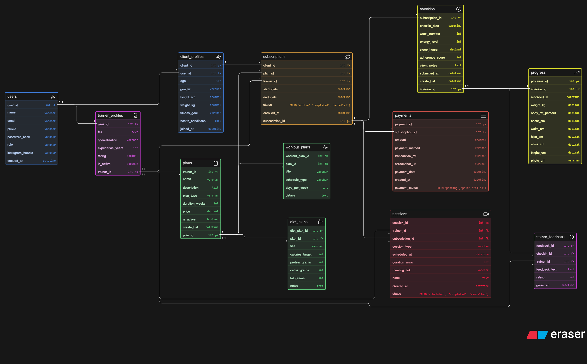

# Fitness Coaching Platform — Database Design

A database design for an online fitness coaching platform run by a fitness influencer. The platform supports client onboarding, coaching plan purchases, session scheduling, weekly check-ins, progress tracking, and payments — all managed through a structured online ecosystem.
---

## Business Context

This is not a gym management system. Key characteristics that shaped the design:

* **One trainer, many clients** — a single influencer/trainer can coach hundreds of clients simultaneously
* **Multiple plan types** — consultation-only, long-term coaching, workout-only, or full diet + workout bundles
* **Sessions ≠ Check-ins** — a session is a scheduled live video call; a check-in is a weekly self-report submitted by the client
* **Progress is separate from the user** — weight, measurements, and photos are tracked over time and must not be mixed into the user table
* **Trainer feedback is separate from check-ins** — a client submits a check-in, then the trainer responds with feedback independently
* **Diet and workout plans are modeled under the parent plan** — each plan can have one workout structure and one diet structure attached

---

## Schema Overview

The database has **13 entities**:

| Entity             | Purpose                                                                          |
| ------------------ | -------------------------------------------------------------------------------- |
| `users`            | Single table for all platform users — role field distinguishes trainer vs client |
| `trainer_profiles` | Extended profile for trainers — bio, specialization, experience                  |
| `client_profiles`  | Extended profile for clients — fitness goals, health info, body stats at signup  |
| `plans`            | Coaching programs created by trainers — type, duration, price                    |
| `workout_plans`    | Workout schedule attached to a plan                                              |
| `diet_plans`       | Diet/nutrition guidance attached to a plan                                       |
| `subscriptions`    | Records which client enrolled in which plan — start/end dates and status         |
| `sessions`         | Scheduled live video or consultation calls between trainer and client            |
| `checkins`         | Weekly self-reports submitted by clients — energy, sleep, adherence              |
| `progress`         | Body measurements and photos recorded per check-in                               |
| `trainer_feedback` | Trainer's response/notes on a client's check-in                                  |
| `payments`         | Payment records per subscription — method, status, UPI ref                       |

---

## Key Design Decisions

### 1. Single `users` table with role field

Both trainers and clients share the same login system. The `role` field (`trainer` / `client`) determines access. Extended details live in `trainer_profiles` and `client_profiles` as separate one-to-one tables — keeping the auth table clean.

### 2. `plans` → `workout_plans` + `diet_plans` as separate tables

A plan can include a workout schedule, a diet plan, both, or neither. Separating them avoids nullable columns on the main plan and allows each to have its own rich attributes (calories, macros, days per week, etc.).

### 3. `subscriptions` as the central junction

The subscription is the core business event — it links a client, a plan, and a trainer together with a start/end date and status. Sessions, check-ins, and payments all reference the subscription, not the plan directly. This ensures proper normalization and avoids redundant client references.

### 4. `sessions` ≠ `checkins`

* **Session** = trainer-initiated scheduled video/audio call, has a meeting link and duration
* **Check-in** = client-initiated weekly self-report with energy level, sleep, adherence score

### 5. `progress` is linked to `checkin_id`

Progress snapshots (weight, measurements, photos) are recorded at the time of each check-in, enabling accurate timeline tracking.

### 6. `trainer_feedback` is separate from `checkins`

The client submits a check-in. The trainer reviews it and responds separately, supporting asynchronous interaction.

### 7. Normalization (Important Update)

* Removed redundant `client_id` from:

  * `sessions`
  * `checkins`
  * `payments`
  * `progress`
* All relationships now flow through `subscription_id`

---

## Relationships

```
users              ||--||   trainer_profiles    : has profile
users              ||--||   client_profiles     : has profile
trainer_profiles   ||--o{   plans               : creates
trainer_profiles   ||--o{   subscriptions       : manages
trainer_profiles   ||--o{   sessions            : conducts
trainer_profiles   ||--o{   trainer_feedback    : gives
client_profiles    ||--o{   subscriptions       : enrolls in
plans              ||--o{   subscriptions       : subscribed via
plans              ||--||   workout_plans       : includes
plans              ||--||   diet_plans          : includes
subscriptions      ||--o{   sessions            : schedules
subscriptions      ||--o{   checkins            : tracks
subscriptions      ||--o{   payments            : billed via
checkins           ||--||   progress            : records
checkins           ||--||   trainer_feedback    : receives
```

---

## Entities and Attributes

### users

| Column           | Type     | Notes                       |
| ---------------- | -------- | --------------------------- |
| user_id          | int PK   |                             |
| name             | varchar  |                             |
| email            | varchar  |                             |
| phone            | varchar  |                             |
| password_hash    | varchar  |                             |
| role             | varchar  | trainer / client            |
| instagram_handle | varchar  | Core to influencer business |
| created_at       | datetime |                             |

### trainer_profiles

| Column           | Type    | Notes                              |
| ---------------- | ------- | ---------------------------------- |
| trainer_id       | int PK  |                                    |
| user_id          | int FK  | → users                            |
| bio              | text    |                                    |
| specialization   | varchar | weight loss / strength / yoga etc. |
| experience_years | int     |                                    |
| rating           | decimal | Avg client rating                  |
| is_active        | boolean |                                    |

### client_profiles

| Column            | Type     | Notes                                 |
| ----------------- | -------- | ------------------------------------- |
| client_id         | int PK   |                                       |
| user_id           | int FK   | → users                               |
| age               | int      |                                       |
| gender            | varchar  |                                       |
| height_cm         | decimal  | Baseline at signup                    |
| weight_kg         | decimal  | Baseline at signup                    |
| fitness_goal      | varchar  | weight loss / muscle gain / endurance |
| health_conditions | text     | Injuries, medical notes               |
| joined_at         | datetime |                                       |

### plans

| Column         | Type     | Notes                                         |
| -------------- | -------- | --------------------------------------------- |
| plan_id        | int PK   |                                               |
| trainer_id     | int FK   | → trainer_profiles                            |
| name           | varchar  |                                               |
| description    | text     |                                               |
| plan_type      | varchar  | consultation / workout / diet / full_coaching |
| duration_weeks | int      |                                               |
| price          | decimal  |                                               |
| is_active      | boolean  |                                               |
| created_at     | datetime |                                               |

### subscriptions

| Column          | Type     | Notes                          |
| --------------- | -------- | ------------------------------ |
| subscription_id | int PK   |                                |
| client_id       | int FK   | → client_profiles              |
| plan_id         | int FK   | → plans                        |
| trainer_id      | int FK   | → trainer_profiles             |
| start_date      | datetime |                                |
| end_date        | datetime |                                |
| status          | ENUM     | active / completed / cancelled |
| enrolled_at     | datetime |                                |

### sessions

| Column          | Type     | Notes                                         |
| --------------- | -------- | --------------------------------------------- |
| session_id      | int PK   |                                               |
| trainer_id      | int FK   | → trainer_profiles                            |
| subscription_id | int FK   | → subscriptions                               |
| session_type    | varchar  | consultation / progress_review / live_workout |
| scheduled_at    | datetime |                                               |
| duration_mins   | int      |                                               |
| meeting_link    | varchar  |                                               |
| status          | ENUM     | scheduled / completed / cancelled             |
| notes           | text     |                                               |
| created_at      | datetime |                                               |

### checkins

| Column          | Type     | Notes           |
| --------------- | -------- | --------------- |
| checkin_id      | int PK   |                 |
| subscription_id | int FK   | → subscriptions |
| checkin_date    | datetime |                 |
| week_number     | int      |                 |
| energy_level    | int      |                 |
| sleep_hours     | decimal  |                 |
| adherence_score | int      |                 |
| client_notes    | text     |                 |
| submitted_at    | datetime |                 |
| created_at      | datetime |                 |

### progress

| Column           | Type     | Notes      |
| ---------------- | -------- | ---------- |
| progress_id      | int PK   |            |
| checkin_id       | int FK   | → checkins |
| recorded_at      | datetime |            |
| weight_kg        | decimal  |            |
| body_fat_percent | decimal  |            |
| chest_cm         | decimal  |            |
| waist_cm         | decimal  |            |
| hips_cm          | decimal  |            |
| arms_cm          | decimal  |            |
| thighs_cm        | decimal  |            |
| photo_url        | varchar  |            |

### trainer_feedback

| Column        | Type     | Notes              |
| ------------- | -------- | ------------------ |
| feedback_id   | int PK   |                    |
| checkin_id    | int FK   | → checkins         |
| trainer_id    | int FK   | → trainer_profiles |
| feedback_text | text     |                    |
| rating        | int      |                    |
| given_at      | datetime |                    |

### payments

| Column          | Type     | Notes                      |
| --------------- | -------- | -------------------------- |
| payment_id      | int PK   |                            |
| subscription_id | int FK   | → subscriptions            |
| amount          | decimal  |                            |
| payment_method  | varchar  | UPI / card / bank_transfer |
| payment_status  | ENUM     | pending / paid / failed    |
| transaction_ref | varchar  |                            |
| screenshot_url  | varchar  |                            |
| payment_date    | datetime |                            |
| created_at      | datetime |                            |

---

## Tools Used

* **Eraser.io** — ERD diagram design

---
---

## ER Diagram

> The ER diagram is included in this repository as:

 <p align="center">
  
</p>

